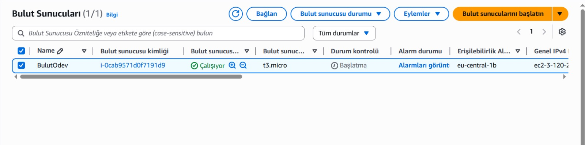
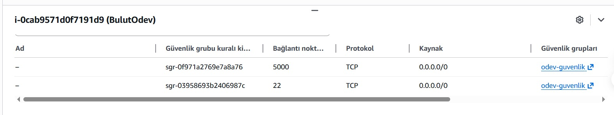
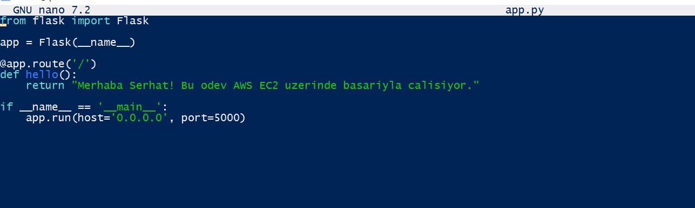
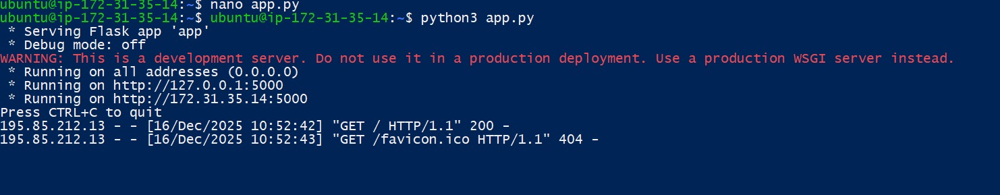
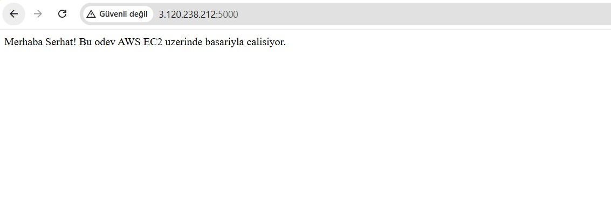

# Bulut Bilişim Ödevi - AWS Üzerinde Flask Uygulaması Dağıtımı

**Ders:** ISE 465 - Bulut Bilişim
**Öğrenci:** Serhat Akca
**Tarih:** Aralık 2025

## 1. Proje Açıklaması ve Amacı
Bu proje, basit bir Python Flask web uygulamasının Amazon Web Services (AWS) bulut platformu üzerinde canlıya alınmasını (deployment) kapsamaktadır. Amaç, sanal sunucu (EC2) yönetimi, ağ güvenliği yapılandırması ve uzaktan sunucu yönetimi (SSH) konularında pratik yetkinlik kazanmaktır.

## 2. Kullanılan Teknolojiler
* **Bulut Sağlayıcı:** AWS (Amazon Web Services)
* **Sunucu:** EC2 t3.micro (Free Tier / Ücretsiz Katman)
* **İşletim Sistemi:** Ubuntu Server 24.04 LTS
* **Yazılım Dili:** Python 3
* **Framework:** Flask

## 3. Adım Adım Kurulum Süreci

### Adım 1: AWS Sunucu Kurulumu
AWS Konsolu üzerinden Frankfurt bölgesinde bir Ubuntu sunucusu oluşturuldu. Maliyet oluşmaması için "Free Tier" (t3.micro) seçildi ve sunucu başarıyla çalışır duruma getirildi.

*Şekil 1: AWS konsolunda sunucunun "Çalışıyor" (Running) durumundaki görüntüsü.*

### Adım 2: Ağ ve Güvenlik Ayarları (Security Group)
Flask uygulamasının dış dünyadan erişilebilir olması için Güvenlik Grubu ayarlandı. 5000 numaralı port (uygulama için) ve 22 numaralı port (SSH bağlantısı için) tüm IP adreslerine açıldı.

*Şekil 2: Port 5000 ve Port 22'nin dış dünyaya açıldığını gösteren güvenlik kuralı.*

### Adım 3: Kodun Sunucuda Oluşturulması
SSH ile sunucuya bağlanıldıktan sonra `nano` editörü kullanılarak `app.py` dosyası oluşturuldu ve Flask uygulama kodları yazıldı.

*Şekil 3: Nano editörü üzerinde Python Flask kodunun yazılması.*

### Adım 4: Uygulamanın Çalıştırılması
Gerekli kütüphaneler (`pip install flask`) kurulduktan sonra uygulama `python3 app.py` komutuyla başlatıldı. Terminalde uygulamanın canlıya geçtiği görüldü.

*Şekil 4: Sunucu terminalinde uygulamanın hatasız çalıştığını gösteren loglar.*

### Adım 5: Sonuç ve Test
Tarayıcı üzerinden sunucunun Genel IP adresi ve 5000. portuna (http://3.120.238.212:5000) gidildiğinde uygulamanın başarılı bir şekilde yanıt verdiği doğrulandı.

*Şekil 5: Web tarayıcısında uygulamanın çalıştığının kanıtı.*

## Karşılaşılan Zorluklar ve Çözümler
**Sorun:** SSH bağlantısı sırasında "WARNING: UNPROTECTED PRIVATE KEY FILE!" hatası alındı.
**Sebep:** Windows, indirilen anahtar dosyasına (.pem) varsayılan olarak çok geniş izinler verdiği için AWS güvenlik gereği bağlantıyı reddetti.
**Çözüm:** Dosya özelliklerinden "Güvenlik" sekmesine gidilerek, dosya üzerindeki yetkiler kısıtlandı ve sadece kullanıcıya "Okuma" izni verildi. Bu sayede güvenli bağlantı sağlandı.

##  Proje Sunum Videosu
Projenin çalışır halini ve detaylı anlatımını içeren sunum videosuna aşağıdaki bağlantıdan ulaşabilirsiniz:

[Video Linki İçin Tıklayınız]((https://youtu.be/qS-QLeHZjgo))
